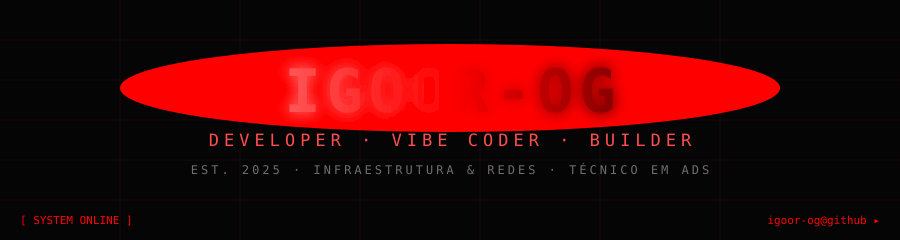

<p align="center">
  
</p>

<p align="center">
  
</p>

<p align="center">
  <kbd>▸ BANNER DE INICIALIZAÇÃO · <b>100%</b> · SEM ERROS ◂</kbd>
</p>

<p align="center">
  <a href="https://git.io/typing-svg">
    
  </a>
</p>

<p align="center">
  
</p>

---

##  01 · SOBRE MIM

<p align="center">
  <sup><code>[ MODULO_PESSOAL ]</code></sup>
</p>

<div align="center">
  <b><i>"Se preciso de um app ou site, eu vou lá e faço."</i></b>
</div>

<p align="center">
  Developer versátil com mentalidade de <b>problem solver</b>: transita entre <b>Vibe Coding / Low-Code</b> (entrega rápida) e <b>código raiz</b> (base sólida). Desde <b>dezembro de 2025</b> construindo produtos reais — do terminal da infraestrutura até o deploy completo de um SaaS.
</p>

<p align="center">
  
  
  
</p>

<p align="center">
  🛰️ <b>Atuação:</b> Estagiário em Infraestrutura e Redes
  &nbsp;·&nbsp; 🗓️ <b>Na área desde:</b> Dezembro de 2025
  &nbsp;·&nbsp; 🎓 <b>Formação:</b> 3º ano Técnico em ADS
</p>

<p align="center">
  🏗️ <b>Base:</b> Programação Avançada · UI/UX Design · Desenvolvimento Mobile
  &nbsp;·&nbsp; 🚀 <b>Entregas:</b> E-commerce · Landing Pages · Apps · CRMs · SaaS
  &nbsp;·&nbsp; 🗺️ <b>Visão:</b> Engenharia de Software / Engenharia de Dados
</p>

<p align="center">
  <sup>
     impacto — transformar código em produto. do terminal da infra ao deploy. sem pular etapas.
  </sup>
</p>

<p align="center">
  
</p>

---

##  02 · SISTEMA DE HABILIDADES

<p align="center">
  <sup><code>[ skill_matrix · carregando telemetria ]</code></sup>
</p>

<br />

<p align="center"><b>🖥️ HTML · CSS · JavaScript</b> &nbsp;<sup>domínio</sup><br/></p>

<p align="center"><b>⚙️ PHP</b> &nbsp;<sup>em evolução</sup><br/></p>

<p align="center"><b>🗄️ SQL · Supabase</b> &nbsp;<sup>banco de dados &amp; backend</sup><br/></p>

<p align="center"><b>🧬 C · C# · Java</b> &nbsp;<sup>em evolução</sup><br/></p>

<p align="center"><b>🛰️ Redes · Infraestrutura</b> &nbsp;<sup>campo de atuação</sup><br/></p>

<p align="center"><b>🎨 UI/UX · Prototipagem</b> &nbsp;<sup>design &amp; experiência</sup><br/></p>

<p align="center"><b>⚡ Vibe Coding · Low-Code</b> &nbsp;<sup>velocidade de entrega</sup><br/></p>

<p align="center">
  
</p>

---

## 03 · TECH STACK &amp; FERRAMENTAS

<h3 align="center">🖥️ Core &amp; Front-end — Domínio</h3>

<p align="center">
  
  
  
  
</p>

<h3 align="center">⚙️ Linguagens em Evolução — Suporte</h3>

<p align="center">
  
  
  
  
</p>

<h3 align="center">🗄️ Banco de Dados &amp; Backend</h3>

<p align="center">
  
  
</p>

<h3 align="center">🛰️ Infraestrutura &amp; Ferramentas</h3>

<p align="center">
  
  
  
  
  
</p>

<p align="center">
  
</p>

---

##  04 · STATUS DO SISTEMA

<p align="center">
  <sup><code>[ live_status · estado atual ]</code></sup>
</p>

<div align="center">
  <sup>telemetria do desenvolvedor — execute localmente:</sup>
</div>

<br />

```ansi
Igor@dev-core:~/profile$ ./system_status.sh
[OK] Loading user profile ......... Done
[OK] Current role ................ Intern · Infrastructure & Networks
[OK] In the field since ......... Dec 2025
[OK] Projects delivered ......... 12+
[..] current_focus .............. Vibe Coding · Low-Code · Code Raiz
[..] learning .................. PHP | SQL | Supabase | C | C# | Java
[=>] next_goal ................. Software / Data Engineering
[SYSTEM] Ready. Always building. ❯
```

<br />

<p align="center">
  
</p>

<p align="center">
   <b>ordem:</b> ideia → arquitetura → código → deploy → iteração
</p>

<p align="center">
  
</p>

---

##  05 · PROJETOS EM DESTAQUE

<p align="center">
  <sup><code>[ delivered_projects · 12+ builds ]</code></sup>
</p>

<br />

| | | |
| :-: | :-: | :-: |
| 🛒 **E-COMMERCE**<br><sub>B2C/B2B · catálogos · checkout · integrações</sub><br> | 🚀 **LANDING PAGES**<br><sub>conversão · copy · design orientado a objetivo</sub><br> | 📊 **CRMs**<br><sub>pipelines · gestão de clientes · automação</sub><br> |
| 📱 **APPS MOBILE**<br><sub>mobile-first · protótipo → publicação</sub><br> | ☁️ **SAAS**<br><sub>dashboards · multi-tenant · produto como serviço</sub><br> | 🔮 **PRÓXIMO BUILD**<br><sub>Eng. de Software &amp; Engenharia de Dados</sub><br> |

<p align="center">
  
</p>

---

##  06 · GITHUB STATISTICS

<p align="center">
  <sup><code>[ github_telemetry · leituras da conta ]</code></sup>
</p>

<br />

<p align="center">
  <a href="https://github.com/anuraghazra/github-readme-stats">
    
  </a>
  <a href="https://github.com/denvercoder1/github-readme-streak-stats">
    
  </a>
</p>

<p align="center">
  <a href="https://github.com/anuraghazra/github-readme-stats">
    
  </a>
</p>

<br />

<p align="center">
  <a href="https://github.com/Ashutosh00710/github-readme-activity-graph">
    
  </a>
</p>

<br />

<p align="center">
  <a href="https://github.com/ryo-ma/github-profile-trophy">
    
  </a>
</p>

<p align="center">
  
</p>

---

##  07 · CONTRIBUTION SNAKE

<p align="center">
  <sup><code>[ activity_module · a cobra engole as contribuições ]</code></sup>
</p>

<br />

<p align="center">
  <picture>
    <source media="(prefers-color-scheme: dark)" srcset="https://raw.githubusercontent.com/platane/snk/output/github-contribution-grid-snake-dark.svg" />
    <source media="(prefers-color-scheme: light)" srcset="https://raw.githubusercontent.com/platane/snk/output/github-contribution-grid-snake.svg" />
    
  </picture>
</p>

<details>
  <summary><b>🔧 Ativar cobrinha PERSONALIZADA com suas contribuições (opcional)</b></summary>

  <br />
  No repositório do seu perfil, crie <code>.github/workflows/snake.yml</code>:

  <br />

  ```yaml
  name: Generate Snake

  on:
    schedule:
      - cron: "0 0 * * *"
    workflow_dispatch:

  jobs:
    generate:
      runs-on: ubuntu-latest
      permissions:
        contents: write
      steps:
        - uses: Platane/snk@v3
          with:
            github_user_name: Igoor-og
            outputs: |
              dist/github-snake.svg
              dist/github-snake-dark.svg?palette=github-dark
        - uses: crazy-max/ghaction-github-pages@v4
          with:
            target_branch: output
            build_dir: dist
          env:
            GITHUB_TOKEN: ${{ secrets.GITHUB_TOKEN }}
  ```

  Depois, troque os links do bloco acima por:

  <br />

  ```
  https://raw.githubusercontent.com/Igoor-og/Igoor-og/output/github-snake-dark.svg
  ```

</details>

<p align="center">
  
</p>

---

##  08 · REDES SOCIAIS &amp; CONTATO

<p align="center">
  <sup><code>[ comms_module · canais abertos ]</code></sup>
</p>

<br />

<p align="center">
  <a href="https://github.com/Igoor-og">
    
  </a>
  <a href="https://www.linkedin.com/in/SEU_LINKEDIN">
    
  </a>
  <a href="mailto:SEU_EMAIL@gmail.com">
    
  </a>
  <a href="https://SEU_PORTFOLIO.com">
    
  </a>
</p>

<p align="center">
  
</p>

<p align="center">
  <sup>⚠️ Substitua <code>SEU_LINKEDIN</code>, <code>SEU_EMAIL</code> e <code>SEU_PORTFOLIO</code> pelos seus links reais.</sup>
</p>

<p align="center">
  
</p>

---

## 🏁 FIM DA TRANSMISSÃO

<p align="center">
  
</p>

<p align="center">
  ⚡ <sub>profile.md · compilado com <code>💜 + ☕</code> desde 2025</sub> ⚡
</p>

<p align="center">
  <sub>Construído com <b>Markdown + HTML + SVG</b> · 100% compatível com a renderização do GitHub · Black &amp; Red Edition</sub>
</p>

<hr />

<p align="center">
  <sub>👽 <i>Se o futuro for uma interface, eu vou ajudar a construí-la.</i></sub>
</p>

<details>
  <summary><b>📦 Como usar este README (setup)</b></summary>

  1. Crie o repositório público <code>Igoor-og/Igoor-og</code>.
  2. Copie o conteúdo deste arquivo para o <code>README.md</code> da raiz.
  3. Copie a pasta <code>assets/</code> junto (contém o banner, divisores, pulso, loader e barras de habilidade — todos SVG animados).
  4. Substitua <code>SEU_LINKEDIN</code>, <code>SEU_EMAIL</code> e <code>SEU_PORTFOLIO</code>.
  5. (Opcional) Configure a cobrinha personalizada no bloco da seção <b>07</b>.

</details>